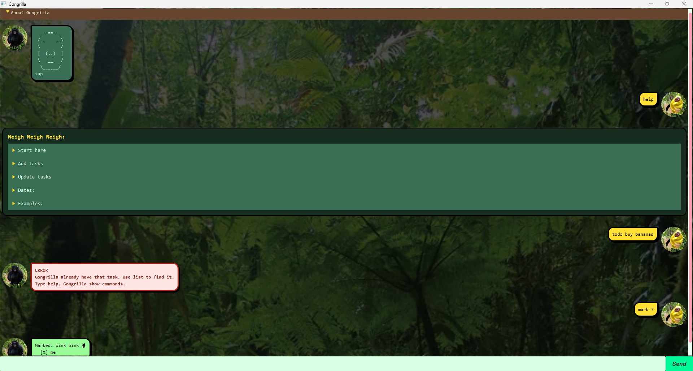

# Gongrilla User Guide

Gongrilla is a friendly task-management chatbot. Type a command in the input box (or terminal) and press **Enter** or click `Send` to get started!

---

## Quick start

1. Start Gongrilla.
2. Type `help` to see the command reference.
3. Add a task, for example: `todo buy bananas`.
4. Type `list` to view your tasks and their numbers.

---
## Features

### Get help: `help`

Displays Gongrilla's command reference and examples.

**Format:** `help`

***

### Add a task: `todo`

Adds a task without a date.

**Format:** `todo TASK`

**Example:** `todo submit project report`
***

### Add a deadline: `deadline`

Adds a task with a due date or date and time.

**Format:** `deadline TASK /by DATE [TIME]`

**Example:** `deadline submit report /by 20/9/2026 1800`
***

### Add an event: `event`

Adds a task with a start and end date/time. The end must be after the start.

**Format:** `event EVENT /from START /to END`

**Example:** `event team meeting /from 20/9/2026 1200 /to 20/9/2026 1300`
***

### View all tasks: `list`

Shows every task in the current list. The displayed numbers are used with `mark`, `unmark`, and `delete`.

**Format:** `list`
***

### Find tasks: `find`

Searches task descriptions for a keyword. The search is case-insensitive and does not change your tasks.

**Format:** `find KEYWORD`

**Example:** `find report`
***

### Mark a task as done: `mark`

Marks the task with the specified number as completed.

**Format:** `mark NUMBER`

**Example:** `mark 1`

***

### Mark a task as incomplete: `unmark`

Removes the completed status from a task.

**Format:** `unmark NUMBER`

**Example:** `unmark 1`

***

### Delete a task: `delete`

Removes the task with the specified number.

**Format:** `delete NUMBER`

**Example:** `delete 2`

***

### Exit Gongrilla: `bye`

Closes the chatbot.

**Format:** `bye`

---

## Dates and input rules

- Dates can be written as `D/M/YYYY` or `YYYY-MM-DD`.
- Add an optional 24-hour time in `HHMM` format, such as `1800`.
- A date without a time is treated as midnight.
- Use `/by` for deadlines, and `/from` followed by `/to` for events. Each parameter must appear once and in that order.
- Task numbers start at `1`. Use the numbers shown by `list`; `find` results are for viewing only.
- Commands are case-insensitive, and extra spaces or tabs are accepted.
- If a command is invalid, Gongrilla explains the problem. Type `help` to check the required format.

--- 

## Saved data

Gongrilla stores tasks in `data/gongrilla.txt` and saves changes automatically. Do not run multiple Gongrilla sessions at the same time, as each session keeps its own task list.
